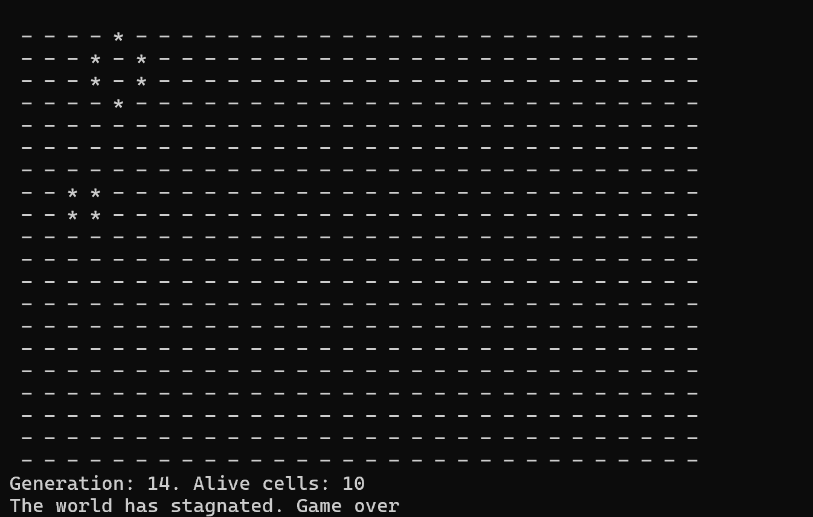
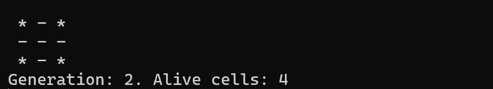

# Игра Жизнь
## Правила игры:
Место действия игры — Вселенная. Это размеченная на клетки ограниченная плоскость.

Каждая клетка на этой плоскости может находиться в двух состояниях: быть «живой», то есть заполненной, или быть «мёртвой», то есть пустой. Клетка имеет восемь соседей, окружающих её.

Распределение живых клеток в начале игры называется первым поколением. Каждое следующее поколение рассчитывается на основе предыдущего по правилам:

1. В пустой (мёртвой) клетке, рядом с которой ровно три живых клетки, зарождается жизнь.
2. Если у живой клетки есть две или три живых соседки, то эта клетка продолжает жить. В противном случае, если соседей меньше двух или больше трёх, клетка умирает «от одиночества» или «от перенаселённости».

### Игра прекращается, если:

на поле не останется ни одной «живой» клетки;
при очередном шаге ни одна из клеток не меняет своего состояния, то есть складывается стабильная конфигурация.
Игрок не принимает прямого участия в игре, а только расставляет начальную конфигурацию «живых» клеток, которые затем взаимодействуют согласно правилам уже без его участия. Он является наблюдателем.

## Скриншоты:

Приятной игры!